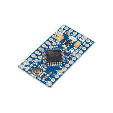
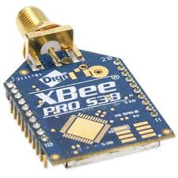
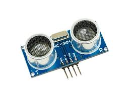
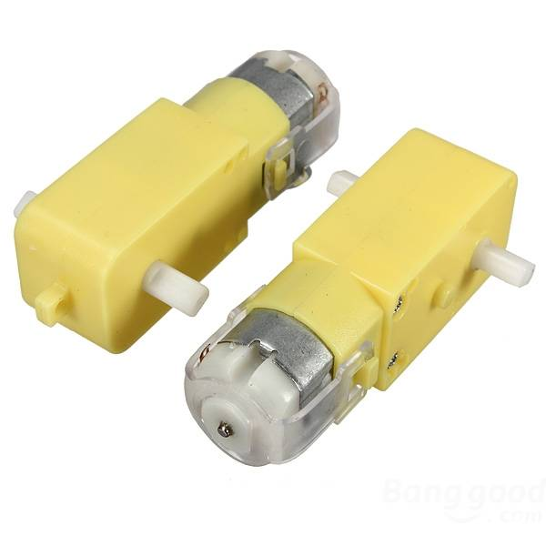
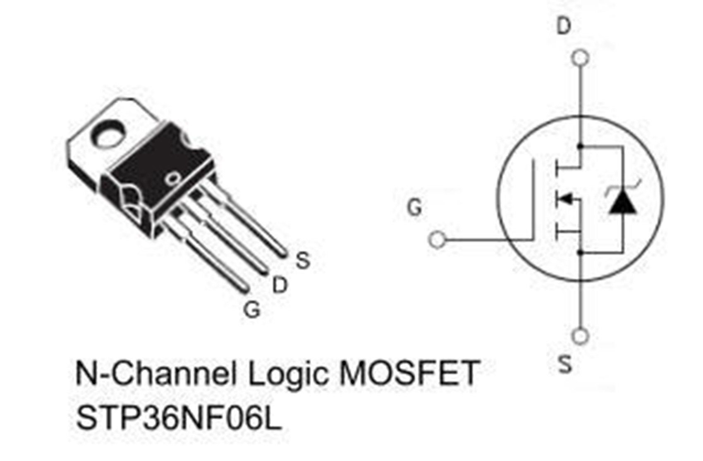

# Project Specification

Item List

* 2x Arduino pró-mini

 

* 2x X-Bee Module

* 2x Sensor Ultrassonic

* Motor DC 9V 

* Mosfet FQP30N06L 60V

## Programming languages used

In this project we used the C and C ++ programming language, as well as Proteus software to simulate some electrical circuits. In addition, we use tools such as 3D printer and laser cutting machine to build the prototype.

